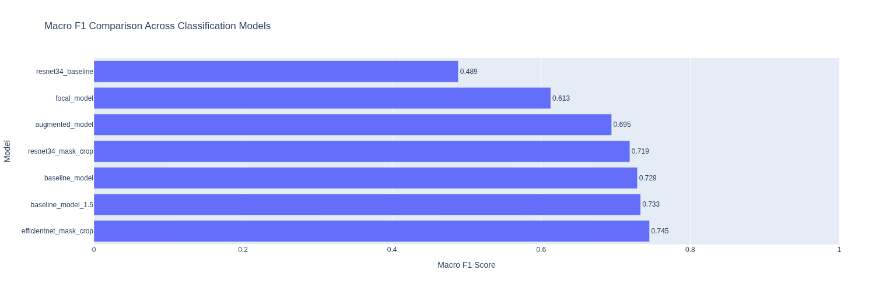
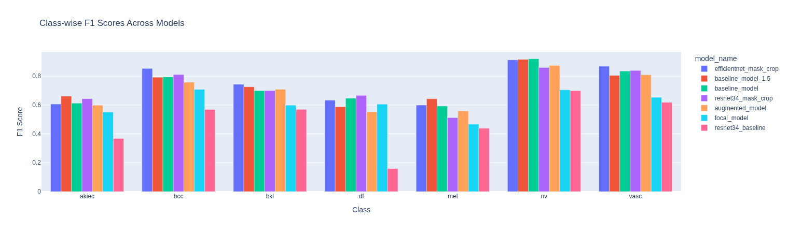
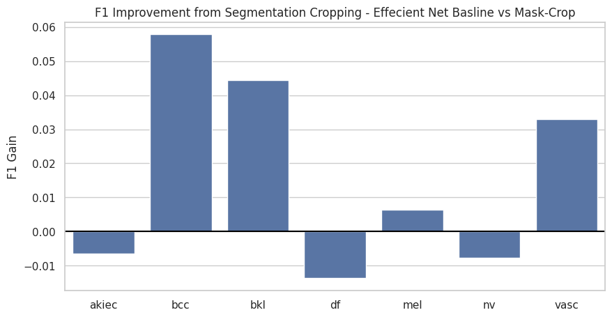

# 🩺 Tele-Dermatology: Skin Lesion Classification & Segmentation

## 📌 1. Problem Statement

Skin cancer is one of the most common cancers worldwide, and early diagnosis significantly improves survival rates. However, access to dermatologists is limited in many regions.

This project explores a **tele-dermatology AI system** that can:

1. **Segment** skin lesions from dermoscopic images
2. **Classify** lesions into diagnostic categories
3. Evaluate whether **lesion-focused training (mask-crop)** improves classification performance
4. Investigate whether **segmentation knowledge transfers** to classification

We combine **segmentation + multimodal classification (image + metadata)** into a unified experimental pipeline.

---

## 🎯 2. Objectives

* Build a robust lesion segmentation model (ISIC dataset)
* Build multimodal lesion classifiers (HAM10000 dataset)
* Compare:

  * Baseline models
  * Augmented models
  * Focal loss models
  * ResNet vs EfficientNet
  * Mask-cropped lesion models
  * Transfer learning from segmentation backbone
* Quantitatively evaluate using:

  * Accuracy
  * Macro F1
  * Weighted F1
  * Class-wise precision/recall/F1
  * Dice & IoU (segmentation)

---


## 📊 3. Datasets

### 🧬 HAM10000 (Classification)

* 7 skin lesion classes:

  * akiec – Actinic keratoses and intraepithelial carcinoma, precancerous lesions that may progress to squamous cell carcinoma.

  * bcc – Basal cell carcinoma, the most common type of skin cancer with low metastatic risk.

  * bkl – Benign keratosis-like lesions, including seborrheic keratoses and other non-cancerous growths.
  
  * df – Dermatofibroma, a benign fibrous skin nodule.
  
  * mel – Melanoma, a highly aggressive and potentially fatal skin cancer.
  
  * nv – Melanocytic nevi, common benign moles.
  
  * vasc – Vascular lesions, including angiomas and other blood-vessel-related skin abnormalities.


| Code  | Full Name                           | Category                 | Dangerous?              |
| ----- | ----------------------------------- | ------------------------ | ----------------------- |
| nv    | Melanocytic nevus                   | Benign mole              | ❌ No                    |
| mel   | Melanoma                            | Malignant cancer         | 🔴 YES (very dangerous) |
| bkl   | Benign keratosis-like lesions       | Benign                   | ❌ No                    |
| bcc   | Basal cell carcinoma                | Malignant (slow-growing) | 🟠 Yes (rarely fatal)   |
| akiec | Actinic keratoses / Bowen's disease | Pre-malignant            | 🟡 Can become cancer    |
| df    | Dermatofibroma                      | Benign                   | ❌ No                    |
| vasc  | Vascular lesions                    | Benign                   | ❌ No                    |


* Includes metadata:

  * Age
  * Sex
  * Localization
  * Image dimensions

### 🧪 ISIC (Segmentation)

* Pixel-level lesion masks
* Used to train a segmentation model
* Bounding boxes derived from masks for classification cropping

---

## 📁 Project Structure

```
Tele_dermatology/
├── data/
│   ├── raw/
│   │   ├── ham10000/                   # Etract and place the ham10000 data here
│   │   ├── ISIC/                       # Extract and place the ISIC data here
│   ├── processed/
│
├── notebooks/
│   ├── EDA
│   ├── Inference notebooks
│   ├── Model comparison
│
├── results/
│   ├── experiments_classification_full.csv
│   ├── experiments_segmentation.csv
│   ├── experiments_transfer_full.csv
│
├── src/
│   ├── dataset loaders
│   ├── training scripts
│   ├── loss functions
│   ├── segmentation bbox generator
│
└── README.md
```

---

### 📁 `src/` Directory Overview

* **datasets.py** – Standard dataset loader for multimodal classification (image + metadata).
* **datasets_mask_crop.py** – Dataset loader that crops lesion regions using segmentation-derived bounding boxes before classification.
* **generate_mask_bboxes.py** – Extracts bounding boxes from segmentation masks and saves them for mask-crop classification training.
* **models.py** – Defines neural network architectures used across experiments (classification and fusion models).
* **losses.py** – Custom loss functions including Dice loss and Focal loss implementations.
* **utils.py** – Helper utilities for training, evaluation, logging, and miscellaneous functions.

---

### 🏋️ Classification Training Scripts

* **train_baseline.py** – Trains EfficientNet-B0 + metadata multimodal baseline model.
* **train_baseline_1.5.py** – Improved baseline with modified training configuration (e.g., tuning or architectural adjustments).
* **training_augmentation.py** – Trains classification model with additional data augmentation strategies.
* **train_focal.py** – Trains classification model using Focal Loss to address class imbalance.
* **train_resnet_baseline.py** – Trains ResNet34 + metadata multimodal baseline model.
* **train_resnet_mask_crop.py** – Trains ResNet34 model using lesion mask-cropped images.
* **train_effecient_mask_crop.py** – Trains EfficientNet-B0 model using segmentation-based mask cropping (best performing model).

---

### 🧬 Segmentation & Transfer Learning

* **train_segmentation_isic.py** – Trains lesion segmentation model on ISIC dataset using BCE + Dice loss.
* **train_transfer_from_seg.py** – Transfers segmentation-trained backbone weights into classification model.
* **train_transfer_multimodal_resnet.py** – Transfer learning experiment with frozen/unfrozen backbone strategy.
* **train_transfer_resnet.py** – Full fine-tuning transfer experiment from segmentation backbone to classification.

---


## 🧠 4. Methodology

### 4.1 Segmentation (ISIC)

* Architecture: ResNet-based encoder
* Input size: 256×256
* Loss: **BCE + Dice**
* Best performance:

  * Mean Dice ≈ **0.90**
  * Mean IoU ≈ **0.82**

Bounding boxes extracted from predicted masks are used for classification cropping.

---

### 4.2 Multimodal Classification (HAM10000)

Each classification model combines:

* 📷 Image backbone (ResNet34 / EfficientNet-B0)
* 📊 Metadata branch (MLP)
* 🔗 Fusion layer (concatenation + classifier head)

Loss:

* CrossEntropy (class weighted)## 📁 Project Structure

---
* Focal Loss (experimentally)

**Best Performing Model:**

`EfficientNet-B0 + Mask-Crop + Metadata`

- Accuracy: 0.8383

- Macro F1: 0.7453

- Weighted F1: 0.8386

This model achieved the best balance between overall performance and minority-class sensitivity.

---

## 🧪 5. Model Variants

### Baselines

* EfficientNet-B0 + Metadata
* ResNet34 + Metadata

### Data Augmentation

* Random rotations
* Horizontal flips

### Focal Loss

* Address class imbalance

### Mask-Crop Models (Key Innovation)

* Use segmentation bounding boxes
* Crop lesion before classification
* Reduces background noise

### Transfer Learning from Segmentation

* Load segmentation backbone weights into classifier
* Evaluate feature reuse

---

## 📈 6. Results Summary

### 🏆 Classification (Best Models)

| Model                      | Accuracy | Macro F1  | Weighted F1 |
| -------------------------- | -------- | --------- | ----------- |
| EfficientNet Baseline      | 0.84     | 0.73      | 0.83        |
| ResNet Baseline            | 0.80     | 0.68      | 0.80        |
| ResNet Mask-Crop           | 0.77     | 0.72      | 0.79        |
| **EfficientNet Mask-Crop** | **0.84** | **0.745** | **0.839**   |

### 🔬 Key Observation

Mask-cropping improved:

* Minority class F1
* Overall macro F1
* Lesion-focused feature learning

EfficientNet + mask-crop achieved the **best balanced performance**.

---

### 📊 Classification Results Comparison

| Model                      | Accuracy   | Macro F1   | Weighted F1 |
| -------------------------- | ---------- | ---------- | ----------- |
| **efficientnet_mask_crop** | **0.8383** | **0.7453** | **0.8386**  |
| baseline_model_1.5         | 0.8403     | 0.7333     | 0.8395      |
| baseline_model             | 0.8373     | 0.7291     | 0.8337      |
| resnet34_mask_crop         | 0.7732     | 0.7190     | 0.7884      |
| augmented_model            | 0.7839     | 0.6945     | 0.7967      |
| focal_model                | 0.6360     | 0.6127     | 0.6585      |
| resnet34_baseline          | 0.5850     | 0.4888     | 0.6251      |

---

### 🧬 Segmentation

`Resnet34 Model` achieved the following metrics:

| Metric    | Value |
| --------- | ----- |
| Mean Dice | 0.903 |
| Mean IoU  | 0.825 |

Segmentation is strong enough to support lesion-focused cropping.

---

## 📊 Model Performance Comparison

#### 1. Macro F1 Comparison 
 

### 2. Classwise F1 Comaprison


### 3. F1 Improvement with Segmentation


---

## 🧠 7. Key Findings

1. **Background noise harms classification.**
2. Mask-cropping improves macro F1 significantly.
3. EfficientNet generalizes better than ResNet in this task.
4. **Transfer learning from segmentation did not outperform direct training.**
5. Macro F1 is critical due to severe class imbalance.

---

# 🧪 Running Experiments

Please download the required libraries before running any scripts.


## 🔹 Option 1 — Run `.sh` Scripts Manually

### Step 1: Make Scripts Executable

From the project root:

```bash
chmod +x scripts/*.sh
chmod +x scripts/run_full_pipeline.sh
```

---

### Step 2: Run Individual Pipelines

#### 🧬 Segmentation Pipeline

```bash
./scripts/run_segmentation.sh
```

#### 📷 Classification Experiments

```bash
./scripts/run_classification.sh
```

#### 🔁 Transfer Learning Experiments

```bash
./scripts/run_transfer.sh
```

#### 🚀 Full Pipeline (All Experiments)

```bash
./run_full_pipeline.sh
```

Logs will be saved automatically inside the `logs/` directory.

---

## 🔹 Option 2 — Use the Makefile (Recommended)

For cleaner experiment management, use the Makefile.

### Run Segmentation

```bash
make segmentation
```

### Run Classification

```bash
make classification
```

### Run Transfer Learning

```bash
make transfer
```

### Run Everything

```bash
make full
```

---


## 🚀 How to Run

### 1️⃣ Install dependencies


If you are using `uv`, please run the following command to install all libraries:

```bash
uv sync
```

**Note**: to install torch with cuda support, please install it separately (not via uv add):

```bash
uv pip install torch torchvision torchaudio --index-url https://download.pytorch.org/whl/cu121
```
---

If you are using pip, then you can directly run the following to install all the required libraries:

```bash
pip install -r requirements.txt
```

---
### 2️⃣ Train Segmentation

```bash
uv run python src/train_segmentation_isic.py
```

### 3️⃣ Train Classification

```bash
uv run python src/train_effecient_mask_crop.py
```

### 4️⃣ Run Inference

Open notebooks in `notebooks/`.

---

## 📊 Evaluation Metrics

### Classification

* Accuracy
* Macro F1 (primary metric)
* Weighted F1
* Per-class precision / recall

### Segmentation

* Dice Score
* Intersection over Union (IoU)

---

## 🔍 Future Work

* Attention-based lesion-focused networks
* End-to-end segmentation + classification joint training
* Vision Transformers
* Clinical validation
* Deployment-ready tele-dermatology interface

---

## 📚 References

* [HAM10000 Dataset](https://www.kaggle.com/datasets/kmader/skin-cancer-mnist-ham10000)

* [ISIC2018 Challenge Task1 Data (Segmentation)](https://www.kaggle.com/datasets/tschandl/isic2018-challenge-task1-data-segmentation)
  

---

## 📜 License

MIT License